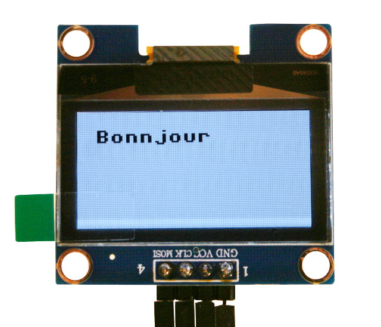
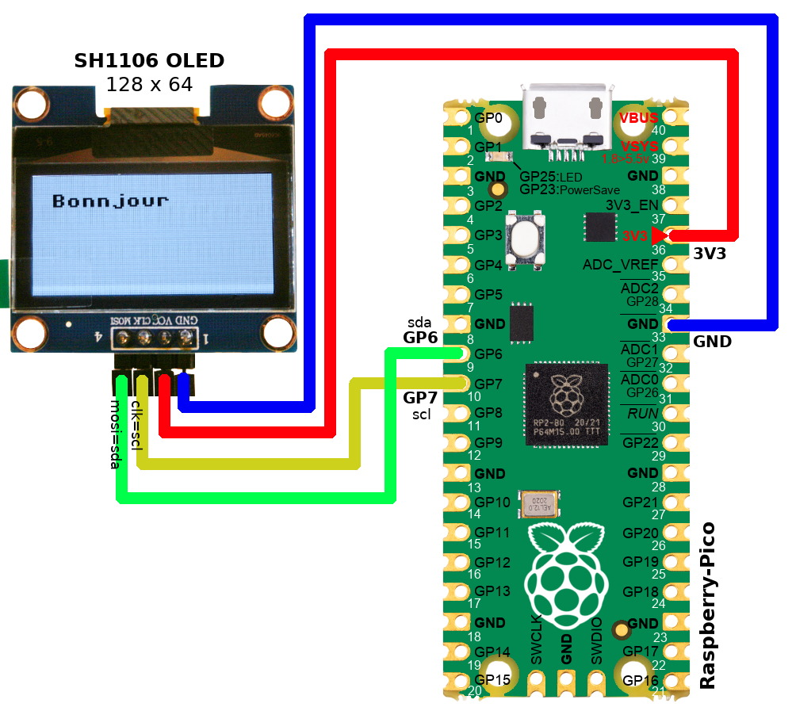

[This file also exist in ENGLISH](readme_ENG.md)

# Pilote OLED SH1106 pour MicroPython

Conntrôler un écran OLED à base de contrôleur SH1106 depuis MicroPython via un bus I2C ou bus SPI. Le pilote est basé sur l'implémentation FrameBuffer et herite donc de toutes les primitives graphique qu'il offre.

La classe SH1106 implémente également des méthodes spéciales permettant de controler l'afficheur.

Pour finit, ce pilote est indépendant de la plateforme MicroPython utilisée (_plateform agnostic_) et peut donc fonctionner sur tous les microcontrôleur exécutant MicroPython.



Une version modifiée de ce pilote est compatible avec [la bibliothèque widget nano-gui](https://github.com/peterhinch/micropython-nano-gui) (version disponible dans les sources de ce projet).

## Credits
Ce pilote est principalement constitué du travail de Radomir Dopieralski (@deshipu).

@robert-hh à ajouté quelques fonctions et modifié quelques fonctions existante pour une meilleure intégration au projet.

@mchobby modification de la structure des répertoires et ajout de quelques ressources. 

## Support IDE avec Type Stubs
La bibliothèque inclue le fichier `.pyi` (type stubs) offrant une meilleure intégration IDE. Cela permet l'utilisation de l'auto-completion et vérification de type dans VS Code ou d'autres éditeurs:
- Assurez vous que les fichiers `.pyi` soient présent dans votre répertoire projet ou accessible dans le PATH python.
- Si besoin, ajouter le répertoire dans le paramètres de votre IDE (ex:  `python.analysis.extraPaths` pour VS Code).
- Si vous utilisez une environnement virtuel, assurez vous que le `stubs` est installé dans cet environnement.

## Rotation de contenu

Le parametre `rotate` du constructeur permet de faire une rotation d'affichage de 90, 180 ou 270 degrés (dans le sens horlogique). Une rotation de 180 degrés est simple, parce que cela peut être réalisé matériellement sur le SH1106 en utilisant un simple _flags_ de configuration. Une rotation a 90 ou 270 degrés implique la création d'un second framebuffer de `width * height / 8` octets en RAM pour effectuer une rotation par voie logicielle. Chaque appel de la méthode `show()` sera 33% plus long.

Fixez la dimension de l'écran (`width` et `height`) dans le constructeur sur les dimentions _physiques_ de votre afficheur, peu importe si vous voulez (ou pas) effectuer une rotation d'affichage.

Vous pouvez utiliser la méthode `flip()` pour effectuer une rotation au vol entre 0 et 180 de rotation, ou entre 90 et 270 degrés. Ce qui correspond à une rotation de 180° par rapport à l'orientation de l'affichage juste avant l'appel à `flip()`.

A noter qu'il n'est pas possible de basculer d'un mode "portrait" au mode "paysage" (et inversement) en cours d'exécution (à cause du buffer complémentaire que cela nécessite).

# Brancher 
## Connexion

Le contrôleur SH1106 supporte aussi bien l'interface I2C que SPI. Les connexions dépendent de l'interface utilisée et du nombre de périphériques dans votre projet. Un ESP8266 disposant de très peu de GPIO, il est forcement nécessaire de faire un choix économique en GPIO.

### I2C
Au minimum, SCL et SDA doivent être connectés. Le pilote accepte également une broche "reset" pour réinitialiser l'afficheur.



Si vous manquez de GPIO, vous pouvez utiliser un circuit comme le MCP100-300 pour créer un signal "reset" pour l'afficheur qui en a vraiment bbesoin.

### SPI
SCLK, MOSI, D/C sont toujours requis. Si l'afficheuur est le seul périphérique SPI alors la broche CS peut-être raccordée sur GND. Le broche "reset" doit également être connectée sur le microcontrôleur (à moins qu'elle ne soit pilotée par un dispositif power-on-reset dédicacé).


# SH1106 Class

Le pilote contient la classe SH1106 qui est dérivé en classes SH1106_I2C et SH1106_SPI .
Hormis le constructor, toutes les méthodes sont identiques pour les classes SH1106_I2C et SH1106_SPI.

## I2C
```
display = sh1106.SH1106_I2C(width, height, i2c, reset, address, rotate=0, delay=0)
```
- `width` et `height` définissent la taille de l'afficheur (largeur et hauteur).
- `i2c` est un objet de type I2C qui doit être ccréé en amont (et spécifiant les broches SDA et SCL du bus).
- `reset` est le GPIO utilisé pour réinitialiser l'afficheur. La broche sera initialisée par le pilote. Utiliser la valeur `None` si non utilisée.
- `address` adresse de l'afficheur sur le bus. 0x3c (60) par défaut.
- `rotate` défini la rotation du contenu.
- `delay` indique un délai optionnel durant la mise sous-tension (ms).


## SPI
```
display = sh1106.SH1106_SPI(width, height, spi, dc, res, cs, rotate=0, delay=0)
```
- `width` et `height` définissent la taille de l'afficheur (largeur et hauteur).
- `spi` est un objet de type SPI qui doit être créé en amont et renseigner les broches MOSI, et SCL. La broche MISO n'est pas utilisée (mais doit probablement être déclarée).
- `dc` est l'objet de type Pin indiquant le GPIO utilisé pour le signal Data/Command. Cet objet sera initialisé par le pilote.
- `res` est le GPIO utilisé pour réinitialiser l'afficheur. La broche sera initialisée par le pilote. Utiliser la valeur `None` si non utilisée.
- `cs` est un objett de type Pin utilisé pour le signal CS (Chip Select). L'objet sera initialisé par le pilote. Utiliser la valeur `None` si le signal n'est pas utilisé. La valeur par défaut `None`.
- `rotate` défini la rotation du contenu.
- `delay` indique un délai optionnel durant la mise sous-tension (ms).


## Méthodes

### display.init_display()
```
display.init_display()
```
Initialise l'afficheur, rempli celui-ci avec la couleur 0 (noir) et affiche un écran vide. Il essaye aussi d'appliquer le signal `reset` si définit dans le constructeur.

### display.power_on() et display.power_off()

```
display.poweron()
display.poweroff()
display.sleep(state)
```
Active et désactive l'afficcheur. `display.sleep(True)` est identique à  `display.poweroff()`,
`display.sleep(False)` est équivalent à `display.poweron()`.

Attention: contrairement à ce que laisse penser son nom, cette méthode ne coupe pas la ligne d'alimentation (Vcc) de l'afficheur.

###  display.contrast()

```
display.contrast(level)
```
Modifie le niveau de contraste de l'afficheur à un niveau compris entre 0 et 255. Dans les faits, sur un afficheur à couleur unique (comme le SH1106), cela contrôle la luminosité de l'afficheur.

###  display.invert()
```
display.invert(flag)
```
Inverse le contenu de l'affichage en fonction de la valeur du _flag_. Son effet est immédiat sur l'écran entier.
- flag = True : inversion
- flag = False : mode normal

###  display.flip()
```
display.flip([flag=None[, update=True]])
```
Fait une rotation du contenu de l'afficheur de 180 degrés additionnel en fonction de l'état du `flag`.

- flag = `True`: si vous avez sélectionné une rotation de 0 ou 90 degrés dans le constructeur, la rotation sera respectivement de 180 ou 270. Sinon, il n'y a pas d'effet.
- flag = `False`: si vous avez sélectionné une rotation de 180 ou 270 degrés dans le constructeur, la rotation sera respectivement de 0 ou 90. Sinon, il n'y a pas d'effet.
- flag = `None`: inverte l'état _flip_. 0 degrés deviendra 180, 90 degrés deviendra 270, 180 deviendra 0 et 270 deviendra 90.

Il faut exécuter `display.show()` pour que l'action soit pleinement effective.

Si le paramètre `update` est `True` alors la fonction appelle automatiquement `show()` .

###  display.show()

Envoi le contenu du _frame buffer_ sur l'afficheur.
```
display.show()
```

Le flux de contrôle habituel d'un programme est de modifier le contenu de l'affichage (le contenu du  _frame buffer_) avec l'appel à differentes méthodes graphique, en fin de traitement l'afficheur est mis-à-jour par un appel à `display.show()` (voir examples ci-dessous).

## Méthodes Framebuffer

Les méthodes de la classe `FrameBuffer` repris dans la liste ci-dessous sont disponibles dans le pilote `SH1106`. 

Plus d'information sur [les méthodes du FrameBuffer dans la documentation MicroPython](http://docs.micropython.org/en/latest/pyboard/library/framebuf.html?highlight=framebuf#module-framebuf) :

- fill
- fill_rect
- line
- vline
- hline
- rect
- pixel
- scroll
- text
- blit
- ellipse


Le texte est affiché avec la font interne 8x8 pixels de MicroPython, qui supporte les caractères ASCII entre 32..127. Le nouveau texte couvre le contenu précédent; uniquement les pixels allumés. 

Si vous voulez ré-écrire une zone de l'écran, il sera nécessaire d'en effacer le contenu de la zone (ex: avec `fill_rect()` ) avant d'y afficher le texte.

Remarque: si vous désirez utiliser d'autre style et taille de font alors voyez le [projet __micropython-font-to-py__ de Peter Hinch (@pythoncoder)](https://github.com/peterhinch/micropython-font-to-py) .

### display.reset()
```
display.reset()
```

Essayer de réinitialiser l'afficheur en manipulant le signal _reset_ . Cela ne fonctionne que si ce signal est effectivement connecté sur l'écran (sinon il ne se passera rien).


# Exemples

## SPI
```
# MicroPython SH1106 OLED driver
#
# Pin Map SPI for ESP8266
#   - 3v - xxxxxx   - Vcc
#   - G  - xxxxxx   - Gnd
#   - D7 - GPIO 13  - Din / MOSI fixed
#   - D5 - GPIO 14  - Clk / SCLK fixed
#   - D8 - GPIO 4   - CS (optional, if the only connected device)
#   - D2 - GPIO 5   - D/C
#   - D1 - GPIO 2   - Res (required, unless a Hardware reset circuit is connected)
#
# for CS, D/C and Res other ports may be chosen.
#
from machine import Pin, SPI
import sh1106

spi = SPI(1, baudrate=1000000)
display = sh1106.SH1106_SPI(128, 64, spi, Pin(5), Pin(2), Pin(4))
display.sleep(False)
display.fill(0)
display.text('Testing 1', 0, 0, 1)
display.show()
```
## I2C

Voir aussi l'exemple [examples/i2c_test.py](examples/i2c_test.py) pour Pico.

```
from machine import Pin, I2C
import sh1106
# ESP8266
i2c = I2C(scl=Pin(5), sda=Pin(4), freq=400000)
display = sh1106.SH1106_I2C(128, 64, i2c, Pin(16), 0x3c)
display.sleep(False) # Allume 
display.fill(0) # 0=Noir
display.text('Testing 1', 0, 0, 1) # 1=blanc
display.show()
```
